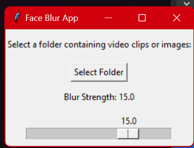
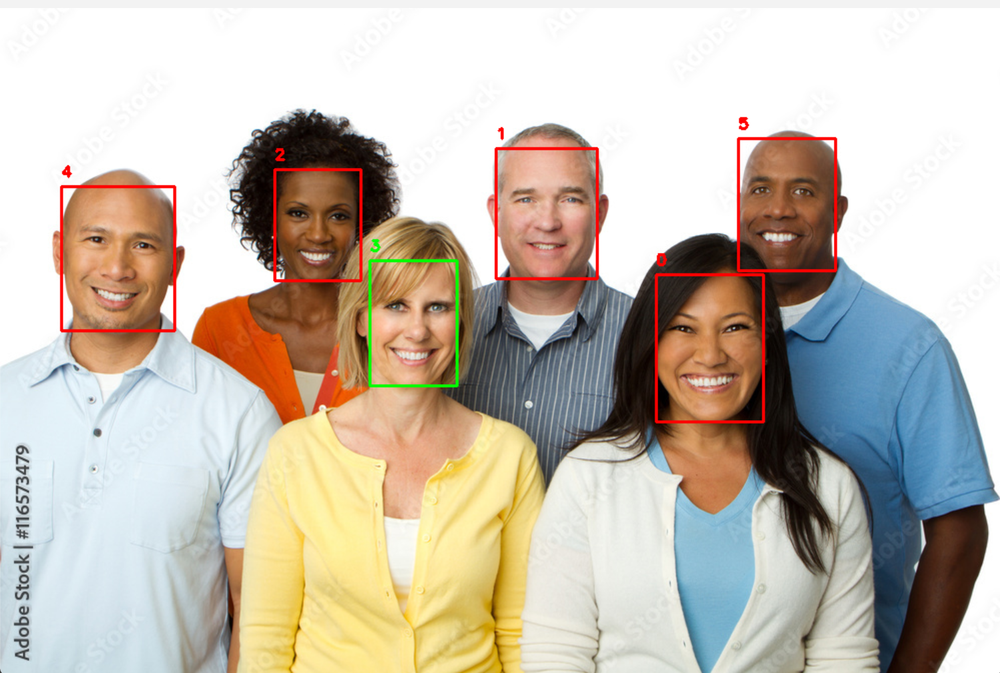
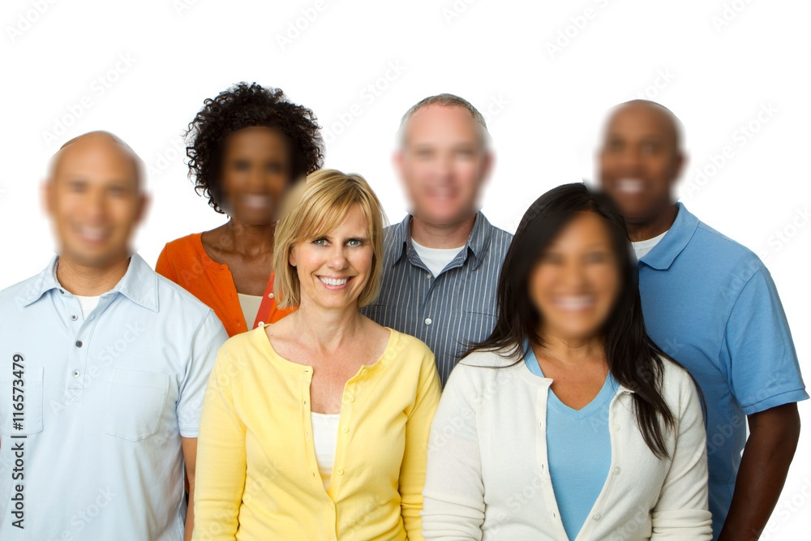

# face_blur_app

This tool was originally created to blur all faces EXCEPT the subject, but if you are training a dataset which will include no faces, here is some guidance:

```
Most importantly - caption the images saying the faces are blurred.
Next you can include some images where the face is cropped out, focusing only on the body. Include a lot of these.
Next for some images obscure the face with a colored shape. Maybe a few white circles, and couple green triangles, etc. You don't even have to obscure the whole face. Probably ok to even leave a couple un-obscured. Update captions accordingly - "a picture of a woman with an hourglass body whose face is censored by a green triangle"


Now your dataset has some variation, and during training the model will LEARN the parts that it should focus on. The point of including the faces obscured is to show that you want to generate full people, not just bodies. And the variation in the blur/censoring won't let it pick up one specific method and include it in the final LoRa. I have had lots of success with this, never even need to put censored/blurred in the negative prompt and never seen censored face show up.
```


This is intended to be used when creating a LoRa dataset. Many users have xperimented with training by censoring faces, and the results were significantly better compared to previous training sessions using uncensored faces.
This approach effectively eliminated any potential bias related to the faces present in the dataset. This technique was already known and applied by some users during the training of other image generation models, and it appears to work well with HunYuan as well.


This app automates blurring the faces in **images or videos**. Can exclude a face if desired.

Use GUI to select faces to blur from a directory. Adjust blur strength with slider if needed. The blurred faces will not overlap the excluded subject (for the most part...)




**RED = BLUR**

**GREEN = DO NOT BLUR**





## INSTALLATION

1. Clone repo
1. Create a virtual environment

```

python -m venv venv

# Activate the virtual environment
venv\Scripts\activate
```

1. Install required packages

```
pip install ultralytics opencv-python ffmpeg-python
```

1. Run the Python script
   
```
python face_blur_app.py

```

## USAGE

1. Select a directory containing images or videos.
2. Images will appear 1 at a time. The green box indicates the face to leave alone, red boxes will be blurred. Press ENTER
3. When finished a new subdir will appear called `output` containing a copy of your files with the targeted faces blurred.

### Adjusting blur

Run the Script: The GUI now shows a slider labeled "Blur Strength" set to 5.
Adjust the Slider: Move it to set the blur intensity (1 = light, 20 = heavy).
Select Folder: Click "Select Folder," choose your images/videos, and proceed as before.
Test: The blur strength applies to all processed files in that run.

**Testing:**
Light Blur: Set to 1 or 2—faces should be slightly softened but recognizable.
Heavy Blur: Set to 15 or 20—faces should be completely obscured.
Current Setting: At 5, **but I usually use 20**

**Customization**
Range: If 1-20 isn’t enough, adjust `from_` and `to_` in the slider (e.g., 0.5 to 30).

